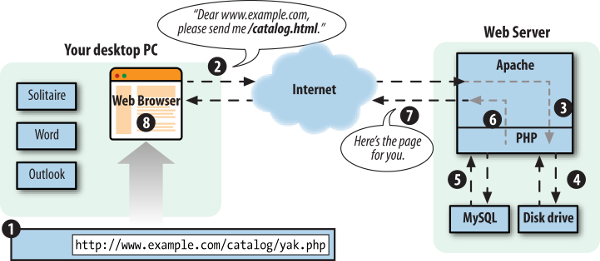
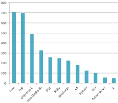

### Recap of basics

#### What is client-server architecture? 🤔
PHP is a programming language that’s used mostly in web development.

When you type www.example.com/asimple.php here is what happens?


Client server architecture _@source : PHP Learning pg 22 - Chapter one (David Sklar) _
1. Your browser sends a message over the Internet to the computer named
www.example.com asking for the asimple.php page.
2. Apache HTTP Server, a program running on the www.example.com computer,
gets the message and asks the PHP engine, another program running on the
www.example.com computer, “What does asimple.php look like?
3. The PHP engine reads the file asimple.php from the disk drive.
4. The PHP engine runs the commands in asimple.php, possibly exchanging data with a
database program such as MySQL.
5. The PHP engine takes the yak.php program output and sends it back to Apache
HTTP Server as an answer to “What does asimple.php look like?”
6. Apache HTTP Server sends the page contents it got from the PHP engine back to
your computer over the Internet in response to your browser’s request.
7. Your browser displays the page on your screen, following the instructions of the
HTML tags in the page.

#### Why is PHP so popular?


PHP popularity, @source : [The  marble](http://themarble.co.uk/top-10-programming-languages)

#### Defining strings in your programs in three different ways
```php
<?php
//single quote
$j = 'string';
//double quote
$jd = "string2";
//here documents
//how does this look like??
```


####  Check the length, removing leading and trailing whitespaces from a string, or comparing it to another string

```php
<?php
//which does what?
trim();
ltrim();
rtrim();
strlen();
strcmp();

```

#### Manipulating case

```php
<?php
//what do these functions do??
strtolower();
strtoupper();
ucwords();

```

#### Selecting part of a string
```php
<?php
//what is the output of the following
$string = "ABCDEFGH IJK";

echo sub_str($string,0,3);

echo sub_string($string,0,strpos(" "));

echo sub_string($string,-5);

```

#### Changing part of a string

```php
<?php

//what is the output of the following

$stringy_B = "I roll with strings";

echo str_replace("i","io",$stringy_B);

echo str_replace(" ","<br/>",$stringy_B);

```

#### Naming variables

```php
<?php
//What's wrong with the following variable names?

$drink-size;
$alp_W4;
$23test;
$apulte2;
$drinkmaster@example.com;
$drink!lots;
$_pasd;
$drink+dinner;
$Ca234;

```

####  Using increment and decrement operators with variables
```php
<?php
//what is the output of the following?

$ndalama = 100;

$incre += $ndalama;

echo $incre;

echo $ndalama++;

echo ++$incre + 1;

```
### Interpolating variables in strings

```php
<?php
//what's the output of the following

$jkf = "@";

echo 'example$jkfexample.com';

echo "example$jkfexample.com";

echo "example{$jkf}example.com";

echo "example'$jkf'example.com";

echo 'example"$jkf"example.com';

echo "example".$jkf."example.com";

```
#### Exercises
- Create a new file named izvipi.php, add a textbox  and a submit button named Niaje, once a name e.g "Name" is typed, output Hello Name. 🤔

Hello exercise!

- Is PHP Case sensitive?
- List 3 ways of commenting code in PHP.
- Would you call PHP a strongly typed language? Using a snippet illustrate?
- Contrast server and client side languages. Which category does PHP fall into?
- Find the errors in this PHP program:

```php

<? php
print 'How are you?';
print 'I'm fine.';
??>
```
- Write a PHP program(powz.php) that uses the increment operator ( ++ ) and the combined
multiplication operator ( *= ) to print out the numbers from 1 to 5 and powers of
2 from 2 to 32.

>_'The sluggard says, “There is a lion in the road! There is a lion in the streets!” '_ ✍✍
