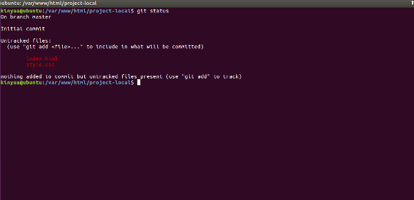
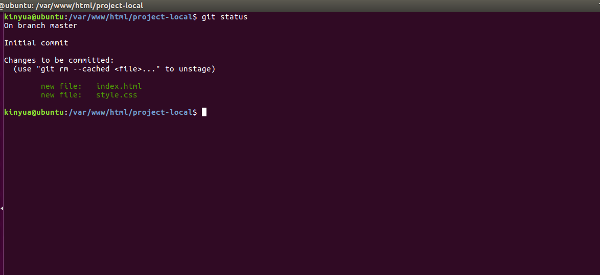

## Git  - A DVCS (Distributed version control system)
### @Rememberer 😉 😉

### What is git?
Git is a software that is used for Version Control. It is free and open source.

@TODO : Distinguish DVCS abd CVCS


@TODO : What are the advantages of using a VCS?
### Prerequisite
- [Install git](https://www.linode.com/docs/development/version-control/how-to-install-git-on-linux-mac-and-windows/)

## Create an Online Git Repository

[GitHub](http://www.github.com/) is the most popular location to host repositories, so go ahead and make an account there if you haven’t.

I’ll assume your username is you. This would make your new GitHub account github.com/YOU.

Once you’ve made your account, create a repository by clicking Add New Repo.

Do not initialize with a README.md or .gitignore at this point. We can call the repository project. Your repository has been created at github.com/YOU/project. It should be completely empty.

## Create a local project

If you’re not at all familiar with the command prompt, please read the first chapter or two of the command line crash course.

### Basic command line reference

  - `pwd` **Print Working Directory** – shows the exact directory you’re
    working in.
  - `ls` **List Directories** – lists all the files and folders in your
    current directory.
  - `cd` **Change Directory** – change to another directory.
  - `mkdir` **Make Directory** – create a new directory.

> Remember, Terminal (Linux/Mac) and Git Bash (Windows) are both command line
> shells. Any Git related Shell commands can be done the same through
> both.

Open the terminal

##### 0\. Change directory to your webroot.
    Windows
      cd C://xampp//htdocs
      cd C://wamp/www
    Linux
      cd /var/www/html
    Mac
      cd /User/your_user_name/Sites

##### 1\. Confirm your location.

    pwd

    /var/www/html

##### 2\. Create a new folder called project-local.

    mkdir project-local

##### 3\. List your directories.

```
ls
```

You should see **project-local** in the list of directories. Of course,
you could have created the directory through Finder or Explorer or Nautilus, but
it’s a useful command to know.

##### 4\. Move into the newly created directory.

    cd project-local

Now you’re in the folder where your local project and Git repository
will live. From here, we will begin using git commands. There is a
[massive amount](http://gitref.org/) of commands for Git, but we only
need a few to get started.

### Basic Git command reference

  - `git config` – Configure Git
  - `git init` – Initialize Git repository
  - `git status` – Check the status of a Git repository
  - `git add` – Track files
  - `git commit` – Commit tracked files
  - `git push` – Upload files
  - `git pull` – Download files

All of the future commands we do today will only apply to your local Git
environment. However, there is one important global step to take before
doing anything else – configure your Git account.

##### 5\. Configure your global Git account.

    git config --global user.name "YOUR_USERNAME"
    git config --global user.email "YOUR_EMAIL_ADDRESS"

Make sure you’re still in the **project-local** folder, then move on.

##### 6\. Initialize Git repository.

    git init

<div class="terminal">

Initialised empty Git repository in /var/www/html/project-local/.git/

</div>

Great\! Now you have an empty Git repo on your local computer.

##### 7\. Hook up local directory with the repo we made at github.com.

    git remote add origin https://github.com/YOU/project
Terminal won’t respond, but it was successful.Check with;

    git remote -v

Go ahead and add a file to the project-local directory. You can add as many files as you want, but I will assume you added two files – index.html and style.css.

##### 8\. Check the status of your local repository.
    git status


##### 9\. Add ALL the files to the repo.

    git add .

Let’s check the status again with git status.




##### 10\. Commit tracked files to the master branch

    git commit -m "Initial commit"

##### 11\. Push the files to the Git repo at github.com.

    git push origin master

Hooray!!! 😜 😜 😉


#### References
- [Getting started with git](https://www.taniarascia.com/getting-started-with-git/)
- [What is git and why should I use it.](https://www.quora.com/What-is-git-and-why-should-I-use-it)

>_"Remember this,had any other condition been better for you than the one in which you are,divin love would have put you there."_ CH Spurgeon ✍ ✍
