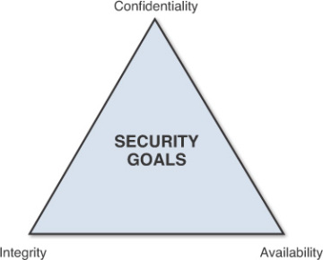

## PHP Security

All information security measures try to address at least one of three goals:

- Protect the confidentiality of data
- Preserve the integrity of data
- Promote the availability of data for authorized use

These goals form the confidentiality, integrity, availability (CIA) triad, the basis of all security programs. Information security professionals who create policies and procedures (often referred to as governance models) must consider each goal when creating a plan to protect a computer system.

The CIA Triad [@source](http://ptgmedia.pearsoncmg.com/images/chap2_9780789753250/elementLinks/02fig01.jpg)

### Considerations
Attack  |  Vulnerability | Threat
--|--|--
Attacks are the techniques that attackers use to exploit the vulnerabilities in applications. Attacks are often confused with vulnerabilities, so please try to be sure that the attack you are describing is something that an attacker would do, rather than a weakness in an application.  |  A vulnerability is a hole or a weakness in the application, which can be a design flaw or an implementation bug, that allows an attacker to cause harm to the stakeholders of an application | A threat that plague a product.While known threats are identified based on signatures, files copied onto the hard drive upon installation, registry keys, protocol analysis and others; we identify unknown threats by studying the product's behavior over a period of time.
(OWASP)

#### Physical
- Theft; Access control (Biometric),Surveillance
- Damage(Natural) eg water;Use Rack mount servers
- Calamities; Fireproof/alarm system
- Recovery; Backup(offline & on-site)
- Encryption; file system
- Any other??

#### Human element (Social engineering)
- Power users (NDA's,Acceptable operation policy)
- Novice users (Training)

#### Data transmission & access (Network)
- Unencrypted connections (http)
- Unencrypted data (plain text)

- The man-in-the middle attack intercepts a communication between two systems. For example, in an http transaction the target is the TCP connection between client and server. Using different techniques, the attacker splits the original TCP connection into 2 new connections, one between the client and the attacker and the other between the attacker and the server.

- @Sol : HTTPS
  - [Let's Encrypt](https://letsencrypt.org/)
  - [$_GET vs $_POST](https://www.diffen.com/difference/GET-vs-POST-HTTP-Requests)

#### Data entry (Input)
- Access control(roles and privileges)
- Input validation & filtering(can anyone enter anything?)
- Files(How do you handle files?)

#### Data output (Output)
- Does your output give too much information?

#### Server security (Host)
- How easy is it to access?([Firewall](https://help.ubuntu.com/community/UFW),Shell access,ports,services)
- Configuring : Distro (Install a server distro) e.g [Ubuntu Server](https://www.techrepublic.com/article/how-to-harden-ubuntu-server-16-04-security-in-five-steps/)
- [Configuration : Apache](https://lucideustech.blogspot.co.ke/2018/03/securing-and-hardening-apache-web.html)
- [Linux vs Windows](https://www.pcworld.com/article/204423/why_linux_beats_windows_for_servers.html) Knockout! 😁 😁
- Any other???

#### Data store security (Database)
- Disable remote root login
- Separate database server and application server
- Backup backup backup
- Access control

#### [Application layer (The PHP App)](https://www.owasp.org/index.php/PHP_Security_Cheat_Sheet)
- What weaknesses does php have?
- Which of the concerns above can be minimised in the app?

###  @TODO : [What are the common vulnerabilities?](resources/OWASP_Top_10-2017_en.pdf)

- Injection
- Broken Authentication
- Sensitive Data Exposure
- XML External Entities
- Security misconfiguration
- Cross-Site Scripting
- Using Components with Known Vulnerabilities
- Insufficient Logging And Monitoring

### @TODO : Tizi

    Q1. What would you consider when dealing with data in PHP?

    Q2. Attack vs Vulnerability vs Threat, using an example, what's the difference?

    Q3. Distinguish DDOS,Session fixation,RFI,CSRF and XSS attacks.

    Q4. From a security perspective, why is logging important?

    
### References
- [
Information Security Principles of Success](http://www.pearsonitcertification.com/articles/article.aspx?p=2218577&seqNum=3)
- [OWASP](https://www.owasp.org)
- [OWASP Top 10 -2017 The Ten Most Critical Web Application Security Risks](resources/OWASP_Top_10-2017_en.pdf)

>_"In God we trust; all others bring data."_ W. Edwards Deming ✍ ✍
