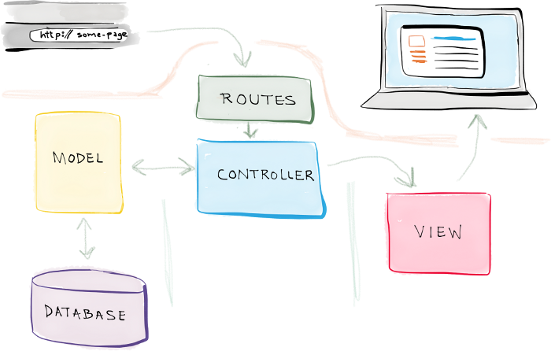

## Stonecold login

>Create a reusable login class taking into consideration most of the possible security threats.

> We will do this using Laravel 🤓 🤓

### Objective
1. Hands on security in PHP(How common vulnerabilities are addressed)
  - Injection
  - Broken Authentication
  - Sensitive Data Exposure
  - XML External Entities
  - Security misconfiguration
  - Cross-Site Scripting
  - Using Components with Known Vulnerabilities
  - Insufficient Logging And Monitoring
2. Laravel 101

### Requirements
- Ubuntu 16.04 LTS
- LEMP / LAMP Stack
- Composer
- Laravel 5.*

#### Installing Ubuntu

Majority of guys are using windows so you will need to choose one of the following options

1. Virtualization
    1. Install VMware Workstation Player
      - [Linux](https://websiteforstudents.com/install-vmware-workstation-player-on-ubuntu-16-04-17-10-18-04-desktop/)
      - [Windows](https://my.vmware.com/en/web/vmware/free#desktop_end_user_computing/vmware_workstation_player/12_0)
    1. [Install Ubuntu on VMware Worstation Player](https://websiteforstudents.com/how-to-install-ubuntu-16-04-17-10-18-04-on-vmware-workstation-guest-machines/)
3. [Dual Boot](https://www.youtube.com/watch?v=qNeJvujdB-0)
3. Cloud Option (DigitalOcean) - Refer to the [Github Student Pack](https://education.github.com/pack) for offer
  - [Create an Ubuntu droplet](https://www.youtube.com/watch?v=irkxCJSOvso)
  - [Secure your droplet : Public/Private Key Auth & Firewall](https://www.digitalocean.com/community/tutorials/initial-server-setup-with-ubuntu-16-04)
  - [Set up HTTPS on your droplet - needs domain name](https://www.digitalocean.com/community/tutorials/how-to-secure-nginx-with-let-s-encrypt-on-ubuntu-16-04) (Bonus 😎 )

#### LEMP / LAMP Stack
- [LEMP - Linux,Nginx,MySQL,PHP](https://www.digitalocean.com/community/tutorials/how-to-install-linux-nginx-mysql-php-lemp-stack-in-ubuntu-16-04)
- [LAMP - Linux,Apache,MySQL,PHP](https://www.digitalocean.com/community/tutorials/how-to-install-linux-apache-mysql-php-lamp-stack-on-ubuntu-16-04)

#### [Install Composer](https://www.digitalocean.com/community/tutorials/how-to-install-and-use-composer-on-ubuntu-16-04)

#### [Install Laravel](https://laravel.com/docs/5.4/installation)

 > NB : Different versions of laravel depend on different PHP versions. Ensure that you install the right one.

 - Laravel 5.2
   - **PHP version between 5.5.9 - 7.1.* **
   - OpenSSL PHP Extension
   - PDO PHP Extension
   - Mbstring PHP Extension
   - Tokenizer PHP Extension
 - Laravel 5.4
    - **PHP >= 5.6.4**
    - OpenSSL PHP Extension
    - PDO PHP Extension
    - Mbstring PHP Extension
    - Tokenizer PHP Extension
    - XML PHP Extension

- Laravel 5.6
    - **PHP >= 7.1.3**
    - OpenSSL PHP Extension
    - PDO PHP Extension
    - Mbstring PHP Extension
    - Tokenizer PHP Extension
    - XML PHP Extension
    - Ctype PHP Extension
    - JSON PHP Extension

##### How do I install PHP extensions? 🤔 🤔

    sudo apt-get install php-VERSION_NAME-EXTENSION_NAME

    e.g.

    sudo apt-get install php-7.0-xml php-7.0-json


##### Install Via Composer Create-Project

    composer create-project --prefer-dist laravel/laravel FOLDER_NAME "LARAVEL_VERSION"

    e.g

    composer create-project --prefer-dist laravel/laravel stonecold "5.4.*"

> NB: Run laravel as a normal apache / nginx app instead of `$php artisan serve`
> Configure a virtualhost for your laravel app
> [Apache](https://gist.github.com/dj1020/e9898200d82ad9a56c84e3cec644b44b) or [Nginx](https://gist.github.com/enginkartal/04d727d361382dc3d41b)

### Stonecold Login 😜 😜 🤡 🤡

#### MVC Design Pattern (Generic)

Laravel applications follow the traditional **Model-View-Controller** design pattern, where you use:

- *Controllers* to handle user requests and retrieve data, by leveraging Models
- *Models* to interact with your database and retrieve your objects’ information
- *Views* to render pages

In addition to this, routes are used to map URLs to designated controller actions.

A simple workflow is as shown below;



[@Source](https://selftaughtcoders.com/from-idea-to-launch/lesson-17/laravel-5-mvc-application-in-10-minutes/)

1. A request is made

    `http://some-laravel-page`
2. The route associated with that URL maps the URL to a controller action.

    `some-page-controller@view`

3. That controller action leverages the necessary model(s) to retrieve information from the database, and then passes that data off to a view.

  `fetch_data from some-page-model`

4. And that view renders the final page.

  `render some-page-view`

> Check this with the default laravel page

> NB : THis is just one of the many juicy features in laravel i.e. it does not explain everything(See Interesting read below) 🤔 🤔


#### [Laravel Directory Structure](https://laravel.com/docs/5.4/structure)

#### Laravel artisan CLI

Artisan is the command-line interface included with Laravel. It provides a number of helpful commands that can assist you while you build your application. To view a list of all available Artisan commands, you may use the list command:

    php artisan list

Some **high level** commands are;

    clear-compiled   Remove the compiled class file
    down  Put the application into maintenance mode
    env  Display the current framework environment
    help  Displays help for a command
    inspire  Display an inspiring quote      list  Lists commands
    migrate  Run the database migrations
    optimize  Optimize the framework for better performance
    serve  Serve the application on the PHP development server
    tinker  Interact with your application
    up  Bring the application out of maintenance mode

#### [(Some) Laravel Security features](http://www.omniceps.com/security-features-laravel-application-security/) 🙂 🙂

#### L5 Application

> At this point you should test that everything works

    On your browser

    http://localhost/URL_TO_LARAVEL_APP/public

    NB : Replace URL_TO_LARAVEL_APP accordingly.

1. Cd to the L5 Directory

    `$ cd /var/www/html/L5_APP`
    (Replace L5_APP accordingly)

1. Set your database credentials
    Open you .env file under L5_APP
```php
DB_CONNECTION=mysql
DB_HOST=127.0.0.1
DB_PORT=3306
DB_DATABASE=DB_NAME
DB_USERNAME=DB_USERNAME
DB_PASSWORD=DB_PASSWORD
```
3. Start with the database
  - Create a [migration](https://laravel.com/docs/5.4/migrations)

    `php artisan make:migration create_anthu_table`
  - Within the up method type;
    ```php
    Schema::create('anthu', function (Blueprint $table) {
        $table->increments('id');
        $table->string('name');
        $table->string('email')->unique();
        $table->string('password');
        $table->rememberToken();
        $table->timestamps();
    });
    ```

  - Run the migration

    `php artisan migrate`
4. Create a model

  `php artisan make:model Anthu`

  ```
  <?php

  //rememeber namespaces?
  namespace App;

  //Notice the aliasing
  //laravel's inbuilt authenitication class
  use Illuminate\Foundation\Auth\User as Authenticatable;

  class Anthu extends Authenticatable{
      //specifies the table associated with this model
      protected $table = 'anthu';
      //the primary key field
      public $primaryKey = 'anthu_id';
      //timestamps
      //this automatically adds timestamps for create and updates (created_at & updated_at)
      public $timestamps = true;
      //what attributes can be assigned
      protected $fillable = array('name', 'email', 'password', 'created_at', 'updated_at','remember_token');
      //hidden attributes
      protected $hidden = array('password');
  }
  ?>
  ```
  > Laravel makes implementing authentication very simple. In fact, almost everything is configured for you out of the box. The authentication configuration file is located at config/auth.php, which contains several well documented options for tweaking the behavior of the authentication services.

 > At its core, Laravel's authentication facilities are made up of "guards" and "providers". Guards define how users are authenticated for each request. For example, Laravel ships with a  session guard which maintains state using session storage and cookies.

 > Providers define how users are retrieved from your persistent storage. Laravel ships with support for retrieving users using Eloquent and the database query builder. However, you are free to define additional providers as needed for your application.

 > Don't worry if this all sounds confusing now! Many applications will never need to modify the default authentication configuration.

 - Modify the authentication configuration(config/auth.php)
    - Custom provider (inside the providers array)
      ```php
      'anthu' => [
          'driver' => 'eloquent',
          'model' => App\Anthu::class,
      ],

      ```
    - Custom guard (inside the guards array)
      ```php
      'anthu' => [
          'driver' => 'session',
          'provider' => 'anthu',
      ],

      ```
    - Set the new guard to default

    ```php

     'defaults' => [
         'guard' => 'anthu',//here
         'passwords' => 'users',
     ],

     ```

5. Specify the routing
  - routes/web.php

  ```php
  //the default route
  Route::get('/',array('as' => '/','uses' => function () {
      return view('welcome');
  }));
  //Login route -- the form
  Route::get('login', array('as' => 'login', 'uses' => 'AnthuController@login'));

  //Login route - the action
  Route::post('anthu/login', array('as' => 'anthu.login', 'uses' => 'AnthuController@attemptLogin'));

  //Logout route
  Route::get('logout', array('as' => 'logout', 'uses' => 'AnthuController@logout'));

  //secure route
  //Laravel will automatically check for user login when this page is accessed. If the user is not logged in the he/she is redirected to login page
  //Laravel ships with an auth middleware, which is defined at  Illuminate\Auth\Middleware\Authenticate. Since this middleware is already registered in your HTTP kernel, all you need to do is attach the middleware to a route definition:
  Route::get('anthu/profile', array('as' => 'anthu.profile', 'uses' => 'AnthuController@profile'))->middleware('auth');

  //Mockr route
  Route::get('mockr', array('as' => 'mockr', 'uses' => 'AnthuController@mockr'));
  ```
6. Create the controller

  `php artisan make:controller AnthuController`

  > adding `--resource` to the above creates basic CRUD methods in the controller class.

  create the `login`,`attemptLogin`, `profile` and `logout` methods

  We will also add a `mockr` (already in routes) method that create as a dummy users.

  - login

  ```php
public function login(){
    return view('anthu.login');
}
```
  - attemptLogin

  ```php
public function attemptLogin(Request $request){
  //request validate
  $this->validate($request, [
      'email' => 'required|email',
      'password' => 'required|min:6'
  ]);

   if (Auth::attempt(array('email' => $request->email, 'password' => $request->password))) {

       return redirect()->route('anthu.profile');
   } else {
       return redirect('login')->withErrors([
       'failed' => 'Username or password incorrect']);

   }
}
```

  - logout

  ```php
public function logout(){
  //log them out
  Auth::logout();
  //redirect to home route
  return redirect()->route('/');
}
```
  - profile

  ```php
  public function profile(){
      return view('anthu.profile');
  }
```
  - mockr


  ```php
  public function mockr(){

    //empty the table.. :D
    Anthu::truncate();

    echo 'Anthu table truncated...<br/>';

    //create some users

    //OOP Approach -- uses Eloquent ORM
    $wambua = new Anthu();
    $wambua->name = 'Wambua Mumo';
    $wambua->email = "wambua@example.com";
    $wambua->password = Hash::make('123456');
    $wambua->save();

    //simple select

    echo "first user inserted : id --> {$wambua->anthu_id}....<br/>";

    $walubengo = new Anthu();
    $walubengo->name = "Walubengo Mwambingu";
    $walubengo->email = "wmwambingu@example.com";
    $walubengo->password = Hash::make('123456');
    $walubengo->save();

    echo "second user inserted : id --> {$walubengo->anthu_id}....<br/>";


    //Using laravel's query builder(Fluent)
    //insert single
    //NB: Timestamps must be added manually when using fluent
    DB::table('anthu')->insert(
      ['name' => 'Muthemba Gaturu','email' => 'mgaturu@example.com', 'password' => Hash::make('123456'),'created_at' => date("Y-m-d H:i:s"),'updated_at' => date("Y-m-d H:i:s")]
    );
    //insert multiple
    DB::table('anthu')->insert([
      ['name' => 'Sironka Naiswako','email' => 'sironka@example.com', 'password' => Hash::make('123456'),'created_at' => date("Y-m-d H:i:s"),'updated_at' => date("Y-m-d H:i:s")],
      ['name' => 'Njakini Flora','email' => 'njakini@example.com', 'password' => Hash::make('123456'),'created_at' => date("Y-m-d H:i:s"),'updated_at' => date("Y-m-d H:i:s")]
    ]);

    echo 'Last bunch..';
    $total = count(Anthu::all());
    echo "<br/> Total number of users {$total}";

  }
```
7.Create the views (resources/views)

  - anthu/login.blade.php
    ```php
    @extends('layouts.app')

    @section('content')
    <div class="container">
        <div class="row">
            <div class="col-md-8 col-md-offset-2">
                <div class="panel panel-default">
                    <div class="panel-heading">Login</div>

                    <div class="panel-body">
                      @if ($errors->has('failed'))
                          <div class="alert alert-danger">
                            <strong>{{ $errors->first('failed') }}</strong>
                          </div>
                      @endif
                        <form class="form-horizontal" method="POST" action="{{ route('anthu.login') }}">
                            {{ csrf_field() }}

                            <div class="form-group{{ $errors->has('email') ? ' has-error' : '' }}">
                                <label for="email" class="col-md-4 control-label">E-Mail Address</label>

                                <div class="col-md-6">
                                    <input id="email" type="email" class="form-control" name="email" value="{{ old('email') }}" required autofocus>

                                    @if ($errors->has('email'))
                                        <span class="help-block">
                                            <strong>{{ $errors->first('email') }}</strong>
                                        </span>
                                    @endif
                                </div>
                            </div>

                            <div class="form-group{{ $errors->has('password') ? ' has-error' : '' }}">
                                <label for="password" class="col-md-4 control-label">Password</label>

                                <div class="col-md-6">
                                    <input id="password" type="password" class="form-control" name="password" required>

                                    @if ($errors->has('password'))
                                        <span class="help-block">
                                            <strong>{{ $errors->first('password') }}</strong>
                                        </span>
                                    @endif
                                </div>
                            </div>

                            <div class="form-group">
                                <div class="col-md-8 col-md-offset-4">
                                    <button type="submit" class="btn btn-primary">
                                        Login
                                    </button>
                                </div>
                            </div>
                        </form>
                    </div>
                </div>
            </div>
        </div>
    </div>
    @endsection

    ```
  - anthu/profile.blade.php


  ```php

  @extends('layouts.app')

  @section('content')
  <div class="container">
      <div class="row">
          <div class="col-md-8 col-md-offset-2">
              <div class="panel panel-default">
                  <div class="panel-heading">Dashboard</div>

                  <div class="panel-body">
                      @if (session('status'))
                          <div class="alert alert-success">
                              {{ session('status') }}
                          </div>
                      @endif

                      You are logged in!
                  </div>
              </div>
          </div>
      </div>
  </div>
  @endsection


    ```
  - welcome.blade.php

```php

  <!doctype html>
  <html lang="{{ app()->getLocale() }}">
      <head>
          <meta charset="utf-8">
          <meta http-equiv="X-UA-Compatible" content="IE=edge">
          <meta name="viewport" content="width=device-width, initial-scale=1">

          <title>{{ config('app.name', 'Laravel') }}</title>

          <!-- Fonts -->
          <link href="https://fonts.googleapis.com/css?family=Raleway:100,600" rel="stylesheet" type="text/css">

          <!-- Styles -->
          <style>
              html, body {
                  background-color: #fff;
                  color: #636b6f;
                  font-family: 'Raleway', sans-serif;
                  font-weight: 100;
                  height: 100vh;
                  margin: 0;
              }

              .full-height {
                  height: 100vh;
              }

              .flex-center {
                  align-items: center;
                  display: flex;
                  justify-content: center;
              }

              .position-ref {
                  position: relative;
              }

              .top-right {
                  position: absolute;
                  right: 10px;
                  top: 18px;
              }

              .content {
                  text-align: center;
              }

              .title {
                  font-size: 84px;
              }

              .links > a {
                  color: #636b6f;
                  padding: 0 25px;
                  font-size: 12px;
                  font-weight: 600;
                  letter-spacing: .1rem;
                  text-decoration: none;
                  text-transform: uppercase;
              }

              .m-b-md {
                  margin-bottom: 30px;
              }
          </style>
      </head>
      <body>
          <div class="flex-center position-ref full-height">
              @if (Route::has('login'))
                  <div class="top-right links">
                      @auth
                          <a href="{{ url('/anthu/profile') }}">Profile</a>
                      @else
                          <a href="{{ route('login') }}">Login</a>
                      @endauth
                  </div>
              @endif

              <div class="content">
                  <div class="title m-b-md">
                      Stone Cold Login
                  </div>

                  <div class="links">
                    @auth
                      
                    @else
                      
                    @endauth
                  </div>
              </div>
          </div>
      </body>
  </html>


  ```
  - layouts/app.blade.php

```php

<!DOCTYPE html>
<html lang="{{ app()->getLocale() }}">
<head>
    <meta charset="utf-8">
    <meta http-equiv="X-UA-Compatible" content="IE=edge">
    <meta name="viewport" content="width=device-width, initial-scale=1">

    <!-- CSRF Token -->
    <meta name="csrf-token" content="{{ csrf_token() }}">

    <title>{{ config('app.name', 'Laravel') }}</title>

    <!-- Styles -->
    <link href="{{ asset('css/app.css') }}" rel="stylesheet">
</head>
<body>
    <div id="app">
        <nav class="navbar navbar-default navbar-static-top">
            <div class="container">
                <div class="navbar-header">

                    <!-- Collapsed Hamburger -->
                    <button type="button" class="navbar-toggle collapsed" data-toggle="collapse" data-target="#app-navbar-collapse">
                        <span class="sr-only">Toggle Navigation</span>
                        <span class="icon-bar"></span>
                        <span class="icon-bar"></span>
                        <span class="icon-bar"></span>
                    </button>

                    <!-- Branding Image -->
                    <a class="navbar-brand" href="{{ url('/') }}">
                        {{ config('app.name', 'Laravel') }}
                    </a>
                </div>

                <div class="collapse navbar-collapse" id="app-navbar-collapse">
                    <!-- Left Side Of Navbar -->
                    <ul class="nav navbar-nav">
                        &nbsp;
                    </ul>

                    <!-- Right Side Of Navbar -->
                    <ul class="nav navbar-nav navbar-right">
                        <!-- Authentication Links -->
                        @if (Auth::guest())
                            <li><a href="{{ route('login') }}">Login</a></li>
                            <li><a href="{{ route('mockr') }}">Mock-R</a></li>
                        @else
                            <li class="dropdown">
                                <a href="#" class="dropdown-toggle" data-toggle="dropdown" role="button" aria-expanded="false">
                                    {{ Auth::user()->name }} <span class="caret"></span>
                                </a>

                                <ul class="dropdown-menu" role="menu">
                                    <li>
                                        <a href="{{ route('logout') }}"
                                            onclick="event.preventDefault();
                                                     document.getElementById('logout-form').submit();">
                                            Logout
                                        </a>

                                        <form id="logout-form" action="{{ route('logout') }}" method="POST" style="display: none;">
                                            {{ csrf_field() }}
                                        </form>
                                    </li>
                                </ul>
                            </li>
                        @endif
                    </ul>
                </div>
            </div>
        </nav>

        @yield('content')
    </div>

    <!-- Scripts -->
    <script src="{{ asset('js/app.js') }}"></script>
</body>
</html>


```

8.Final checks
 - In your .env file ensure SESSION_DOMAIN=YOUR_DOMAIN(Localhost)

9.Rejoice 😂 😂 😂 😅
 - Go to localhost/APP/mockr (add some dummy data)
  - Login and see

10.Ponder

  Laravel security features

  1. Laravel’s own Authentication system: we saw knit within laraevels skeleton is  the authentication system; Laravel uses **“providers”** and **“guards”** to facilitate authentication.
  2. Protection against SQL injection:Eloquent ORM in Laravel uses PDO parameter binding in order to fight against SQL injection. This type of binding the parameters ensures that the data passed from users in request variables are directly not utilized in SQL queries.
  3. Protection against CSRF (Cross Site Request Forgery): Laravel uses CSRF tokens in order to restrict 3rd parties from generating forged requests. Usually this is done by generating and adding a valid token that should be added in each request whether its coming from a form or whether its an AJAX request. (See login form)
  4.  Protection against XSS (Cross Site Scripting):Laravel does automatic escaping while saving content to database and also while printing out content in the HTML. Blade templating engine escapes output, {{$some_variable}}, input filtering /validation is also useful.

### @TODO : Tizi

    Q1. What is artisan in laravel?
    Q2. Describe 5 top-level artisan commands that you like.
    Q3. We described laravel as MVC, where does **middleware** come in? what is it?

## References
- [Laravel Documentation - Installation](https://laravel.com/docs/5.4/installation)
- [DigitalOcean Tutorials](https://www.digitalocean.com/community/tutorials)
- [OWASP Top 10 -2017 The Ten Most Critical Web Application Security Risks](resources/OWASP_Top_10-2017_en.pdf)
- [Creating a Basic Laravel 5 MVC Application in 10 Minutes](https://selftaughtcoders.com/from-idea-to-launch/lesson-17/laravel-5-mvc-application-in-10-minutes/)
- [Artisan Console](https://laravel.com/docs/5.4/artisan)
- [Interesting read : Why Laravel is NOT an MVC framework and you should forget about MVC](https://www.linkedin.com/pulse/why-laravel-mvc-framework-you-should-forget-kali-dass)
- [Security Features of Laravel 5 | Improve Laravel Application Security Further](http://www.omniceps.com/security-features-laravel-application-security/)
>_"Above all else, guard your affections. For they influence everything else in your life."_ ✍ ✍
